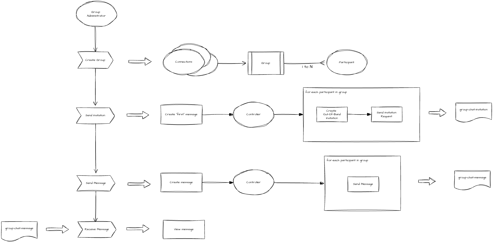
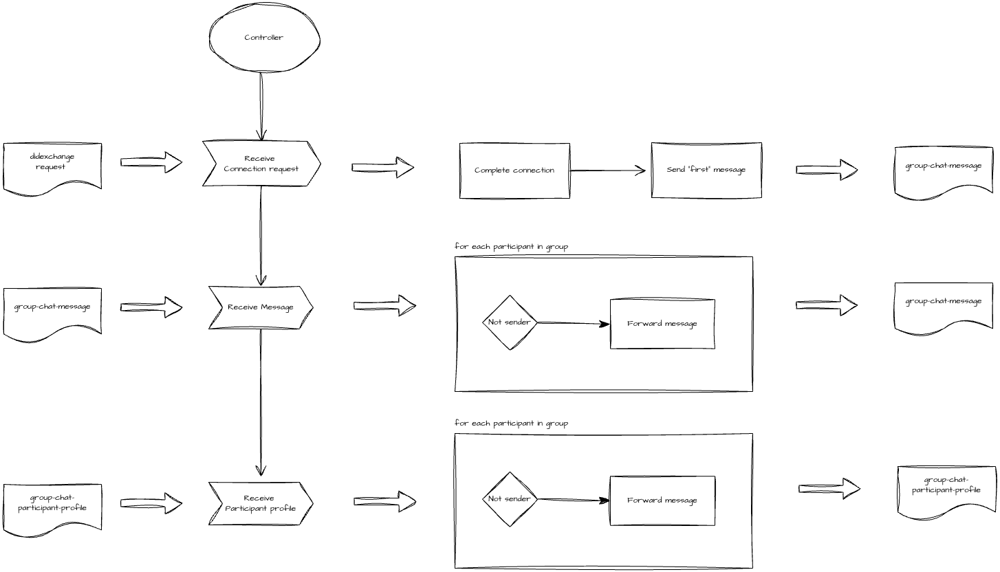
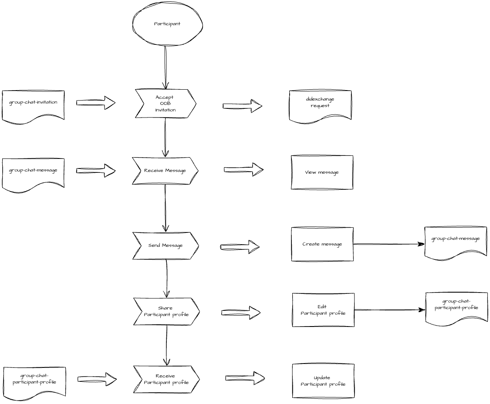

## Summary
The DIDComm Group Chat protocol supports message exchange between a group of individuals or a group comprised of an organization and 1 or more of its community members. A `Group Chat` conversation is a collection of text or media messages sorted as a time series. Unlike the `BasicMessage` or `Conversation` protocols that constrain participation to pairwise connections, the `Group Chat` protocol supports secure end-to-end message exchange between Group Chat participants that may not all have direct trusted connections between.

## Motivation
Conversational text messaging is a type of digital interaction that most internet users are familiar with. There is a wide array of messaging apps readily available to support private and public conversation messaging between individuals and/or organizations. Unlike most of the messaging tools available today, the `Group Chat` protocol enables conversational messaging between a groups of individuals and/or organizations over DIDComm without requiring the use of privacy invasive identifiers such as phone numbers or email addresses.

### Name and Version

This is the Group Chat protocol. It is uniquely identified by the URI:

    "https://didcomm.org/group-chat/1.0"

## Roles

This protocol defines the roles of `participant`, `administrator` and `controller` to support Group Chat message and participant meta-data coordination.

- `administrator`: A person or organization entity that initiates and administers a Group Chat conversation. The `administrator` delegates protocol activities to its corresponding `controller` agent.
- `participant`: An agent participating in a Group Chat conversation. 
- `controller`: The agent that processes protocol activities initiated by a Group Chat administrator. The `controller` can initiate a Group Chat conversation by triggering an invitation request message to a group of connected parties. The `controller` also forwards `received` conversation messages to group chat participants.


## Connectivity
The `controller` participant must have a connection with the collection of participants initially invited to join the conversation. A `participant` must have a DIDComm connection to the `controller` participant but may not be connected to all of the participants.

## Basic Walkthrough

### group-chat-invitation
A Group Chat conversation is initiated when an `administrator` user sends an initial message to a group of active connections. The administrator's `controller` agent iterates through each connection and creates an [Out-of-Band](https://identity.foundation/didcomm-messaging/spec/#out-of-band-messages) invitation used to establish a private Group Chat messaging channel between the `controller` and `participant` agents. The `controller` agent emits a `group-chat-invitation` protocol message to each `participant` connection. The `group-chat-invitation` message includes meta-data about the Group Chat including a Group Chat identifier `ConversationId`, a human-readable participant identifier `ParticipantAlias` and the Out-of-Band invitation URL `oobUrl`. 



Each `participant` agent in the group receives the `group-chat-invitation` message and presents the invitation request to the holder. If the holder chooses to accept the invitation request, the `participant` agent initiates a [DID Exchange](https://didcomm.org/didexchange/1.1/) with the Group Chat's `controller` agent. The `controller` agent negotiates a pairwise DID connection with the `participant` agent and once the connection reaches a `completed` or `active` state, emits a `group-chat-message` with the contents of the Group Chat's initial message.



### group-chat-message
The Group Chat's `controller` agent or any one of the group `participant` agents can emit a `group-chat-message` protocol message. When an `administrator` participant sends a new message to the group, the `controller` agent must iterate through each of the `active` participants and emit a `group-chat-message`. In the case where a `participant` sends a new message to the group, the `participant` agent emits a `group-chat-message` to the `controller` agent delegating to it the responsibility of `forwarding` the message contents to the rest of the group. To `forward` the received message, the `controller` agent must iterate through each of the `active` participants (omitting the message `sender`) and emit a `group-chat-message` with the message contents.



### group-chat-participant-profile
By design, there is no personally identifying information (PII) shared between the group chat participants. The Group Chat `controller` does assign a participant `alias` (a human-readable pseudonymous identifier) to each `participant` that is used to identify the group participants. The `group-chat-participant-profile` enables a `participant` to change the participant `alias` and broadcast the change to the group via the `controller` agent path. To `forward` the received message, the `controller` agent must iterate through each of the `active` participants (omitting the message `sender`) and emit a `group-chat-participant-profile` with the updated participant meta-data.


## Messages
### group-chat-invitation Request Message
The protocol begins when the `controller` sends a `group-chat-invitation` message to a group of connections:

DIDComm V1 Example:
```json
{
    "@type": "https://didcomm.org/group-chat/1.0/request",
    "@id": "8192855c-89f3-5bb5-4971-7be10cbc6c71",
    "~thread": {
        "thid": "5689db78-5123-2aad-448d-0203107fee11"
    },
    "request": {
        "ConversationId": "db31a8e7-0fc9-4736-acd8-d43ecc1283a7",
        "Subject": "Holiday Banquet",
        "CreatedAt": "2025-11-26T04:55:29.667Z",
        "InvitationDate": "2025-11-26T04:55:29.667Z",
        "InvitationUrl": "https://<domain>/<path>?_oob=<encodedplaintextjwm>",
        "Participant": [
            {
                "isContact": true,
                "isGroup": false,
                "ConnectionId": "did:peer:1zQmenZKxSYu84JHpiUTXY3zPD4kfFuahugsPfisBGWH49aG",
                "GroupMemberId": "6Wt2yv"
            }
        ]
    }
}
```

The items in the message are as follows:

- `@type` -- required, must be as above
- `@id` -- required, must be as defined in [RFC 0005 DIDComm]
- `~thread` -- required, must be as defined in [RFC 0008 Message ID and Threading]
- `request` -- required, a json object containing details of the Group Chat, Participant and Out-Of-Band invitation meta-data
    - `ConversationId` -- required, contains the Group Chat identifier to uniquely identify the conversation
    - `Subject` -- required, contains the name to describe the subject of the conversation
    - `CreatedAt` -- required, timestamp in ISO 8601 format denoting when the Group Chat was created
    - `InvitationDate` -- required, timestamp in ISO 8601 format denoting when the Group Chat invitation request message was emitted.
    - `InvitationUrl` -- required, contains the Out-Of-Band invitation URL used to establish a private group chat messaging channel with the requester
    - `Participant` -- required, json array containing participant meta-data including the pseudonymous identifier to be used as the participant alias

DIDComm V2 Example:
```json
{
    "type": "https://didcomm.org/group-chat/1.0/request",
    "id": "8192855c-89f3-5bb5-4971-7be10cbc6c71",
    "thid": "5689db78-5123-2aad-448d-0203107fee11",
    "body": {
        "ConversationId": "db31a8e7-0fc9-4736-acd8-d43ecc1283a7",
        "Subject": "Holiday Banquet",
        "CreatedAt": "2025-11-26T04:55:29.667Z",
        "InvitationDate": "2025-11-26T04:55:29.667Z",
        "InvitationUrl": "https://<domain>/<path>?_oob=<encodedplaintextjwm>",
        "Participant": [
            {
                "isContact": true,
                "isGroup": false,
                "ConnectionId": "did:peer:1zQmenZKxSYu84JHpiUTXY3zPD4kfFuahugsPfisBGWH49aG",
                "GroupMemberId": "6Wt2yv"
            }
        ]
    }
}
```

### group-chat-message Message

A Group Chat message is broadcast to all group chat participants if authored by the `administrator`. If authored by a `participant`, the group chat message is sent to the `controller` which then forwards the message to group participants on behalf of the author.

DIDComm V1 Example:
```json
{
    "@type": "https://didcomm.org/group-chat/1.0/message",
    "@id": "c13002c5-3712-4901-9287-6dc9e248a95f",
    "~thread": {
        "thid": "5689db78-5123-2aad-448d-0203107fee11"
    },
    "request": {
      "ConversationId": "db31a8e7-0fc9-4736-acd8-d43ecc1283a7",
      "Messages": [
        {
          "Id": "b2f56e72-5b7b-4608-abe7-0040a7d23fed",
          "Content": "This is the message content.",
          "SenderAlias": "5ZtFws",
          "SentDateTime": "2025-11-26T04:55:29.667Z",
          "MessageForward": false
        }
      ]
    }
}
```

The items in the message are as follows:

- `@type` -- required, must be as above
- `@id` -- required, must be as defined in [RFC 0005 DIDComm]
- `~thread` -- required, must be as defined in [RFC 0008 Message ID and Threading]
- `request` -- required, a json object containing details of the Group Chat, Participant and Out-Of-Band invitation meta-data
    - `ConversationId` -- required, contains the Group Chat identifier to uniquely identify the conversation
    - `Messages` -- required, json array containing message items
    - `Id` -- required, contains the message identifier to uniquely identify the message
    - `Content` -- required, contains the text message content.
    - `SenderAlias` -- required, denotes the message sender participant using the controller assigned participant alias
    - `SentDateTime` -- required, timestamp in ISO 8601 format denoting when the message was authored
    - `MessageForward` -- required, boolean flag denoting if a received message was forwarded by the controller on behalf of a the Participant who authored the message contents.
   

DIDComm V2 Example:
```json
{
    "type": "https://didcomm.org/group-chat/1.0/message",
    "id": "c13002c5-3712-4901-9287-6dc9e248a95f",
    "thid": "5689db78-5123-2aad-448d-0203107fee11",
    "body": {
      "ConversationId": "db31a8e7-0fc9-4736-acd8-d43ecc1283a7",
      "Messages": [
        {
          "Id": "b2f56e72-5b7b-4608-abe7-0040a7d23fed",
          "Content": "This is the message content.",
          "SenderAlias": "5ZtFws",
          "SentDateTime": "2025-11-26T04:55:29.667Z",
          "MessageForward": false
        }
      ]
    }
}
```

## Implementations

Implementation/Application Name | Developer
--- | ---
[Unmio mobile](https://www.unmio.com/download) | [Entidad](https://www.entidad.io)
[Unmio](https://www.unmio.com/) | [Entidad](https://www.entidad.io)
